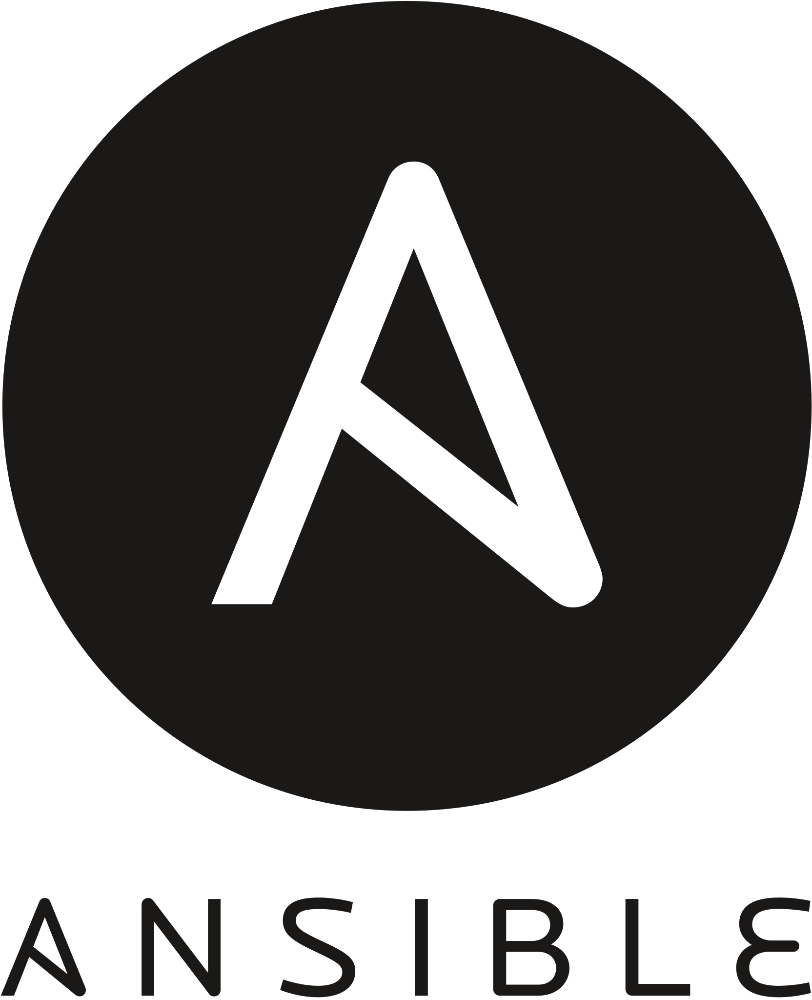

<h1 align="center">Hi , I'm <a>Mikail Furkan</a>  
 Welcome to My GitHub Page</h1>

- 🔭 I’m currently working on **AWS & DevOps**
- 🌱 I am eager to learn cloud computing and devops tools
- 💬 I am passionate to learn and cooperate, and I am eager to share my knowledge
- ⚡ An individual who tries to improve and update myself in the field of software and to benefit people on this platform. Especially DevOps & Cloud Engineer enthusiast

## SKILLS & TOOLS
                

## CERTIFICATIONS

</a>

## AWS Projects
|  Name                  |                                                    Description                                                                       |
| ----------------------- | :---------------------------------------------------------------------------------------------------------------------------------------: |
| Flask-Web-Application       |[Handling Routes, Templates, Forms and SQL with Flask Web Application](https://github.com/furkanalp/AWS_Projets/tree/main/Flask)|
|CloudFormation| [Creating Cloud architecture using AWS Cloudformation Service with other AWS Services and by scripting Template files](https://github.com/furkanalp/AWS_Projets/tree/main/CloudFormation)|
|Project-101   |[Kittens Carousel Static Website deployed on AWS EC2 using Cloudformation](https://github.com/furkanalp/AWS_Projets/tree/main/Project-101-kittens-carousel-static-website-ec2)| 
|Project-102     | [Roman Numerals Converter Application (Python Flask) deployed on AWS EC2 with Cloudformation and AWS CLI](https://github.com/furkanalp/AWS_Projets/tree/main/Project-102-Roman-Numerals-Converter)|
|Project-103   | [Phonebook Application (Python Flask) deployed on AWS Application Load Balancer with Auto Scaling and RDS using AWS Cloudformation](https://github.com/furkanalp/AWS_Projets/tree/main/Project-103-Phonebook-Application)|
|Project-104   | [Kittens Carousel Static Website deployed on AWS Cloudfront, S3 and Route 53 using Cloudformation](https://github.com/furkanalp/AWS_Projets/tree/main/Project-104-kittens-carousel-static-web-s3-cf)|
|Project-501   | [Capstone Project - Blog Page App (Django) on AWS Environment](https://github.com/furkanalp/AWS_Projets/tree/main/Project-501-Capstone-Project-Blog-Page-App-(Django)-on-AWS-Environment)|

## DevOps Projects
|  Name                  |                                                    Description                                                                       |
| ----------------------- | :---------------------------------------------------------------------------------------------------------------------------------------: |
|Project - 201               |[Phonebook Application (Python Flask) deployed on AWS Application Load Balancer with Auto Scaling and Relational Database Service using Terraform](https://github.com/furkanalp/-DevOps_Projects/tree/main/Project-201-Terraform-Phonebook-Application-deployed-on-AWS)|
|Project - 202               |[Dockerization of Bookstore Web API (Python Flask) with MySQL ](https://github.com/furkanalp/-DevOps_Projects/tree/main/202-dockerization-bookstore-api-on-python-flask-mysql)|
|Project - 203               |[Containerization of Java Application using Docker ](https://github.com/furkanalp/Docker/tree/main/vprofile-project/docker-files)|
|Project - 204               |[Java App Deployment on Kubernetes Cluster ](https://github.com/furkanalp/Kubernetes/tree/main/vprofile-project-kub/k8s)|
|Project - 205             | [Docker Swarm Deployment of Phonebook Application (Python Flask) with MySQL ](https://github.com/furkanalp/-DevOps_Projects/tree/main/203-docker-swarm-deployment-of-phonebook-app-on-python-flask-mysql-Terraform)|
|Project - 206             | [Microservice Architecture for Phonebook Web Application (Python Flask) with MySQL using Kubernetes ](https://github.com/furkanalp/-DevOps_Projects/tree/main/204-Kubernetes-Microservice-Phonebook)|

